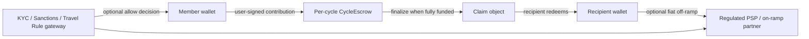
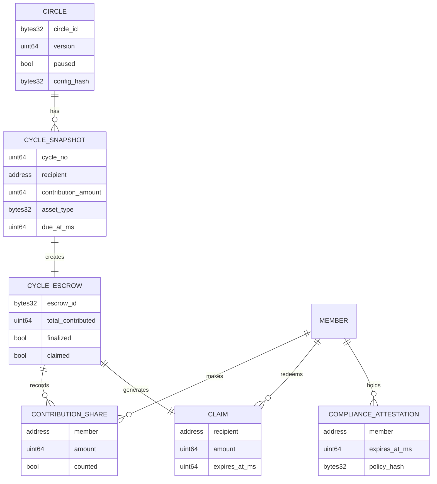
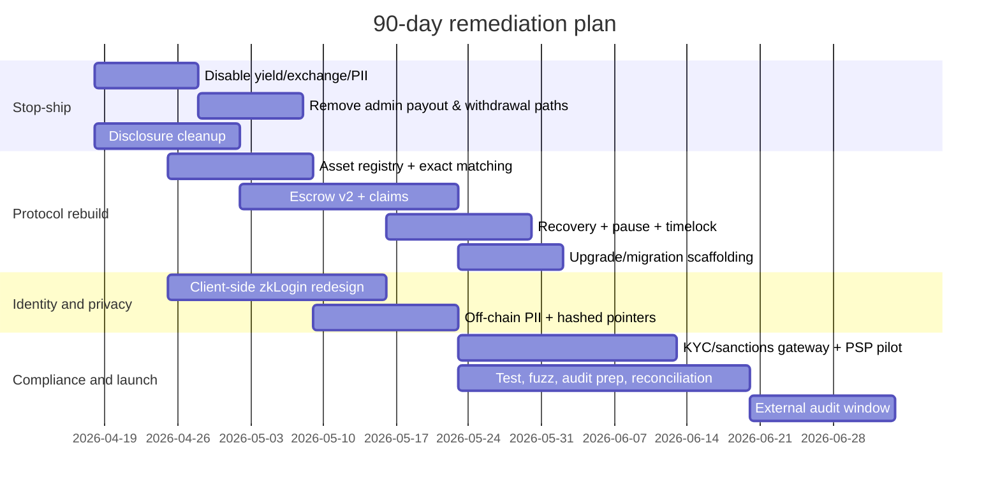

# Njangi-on-Chain Compliance Remediation and Go-to-Market Plan

## Executive summary

The current public repo is **not ready for a pilot with real value**. The codebase still exposes an **admin-controlled shared custody wallet**, **admin-triggered and admin-forced payouts**, **placeholder yield transfers to external addresses**, **substring-based asset/oracle identity checks**, **on-chain messaging metadata**, and **server-side handling of zkLogin ephemeral private keys**. The repo README also still markets “automated payout,” public-auditability, upcoming yield-bearing deposits, and links to Coinbase on-ramp operations, which increases both security and consumer-protection exposure if the code remains operator-controlled. citeturn2view0turn5view1turn5view2turn9view0turn8view0turn9view1turn11view1

The safest path to market is **not** “patch around the edges.” It is a structural pivot to a **deterministic, per-cycle escrow + recipient-claim architecture** with: one allowlisted asset per circle in the MVP; no operator withdrawals; no yield; no on-chain PII; client-side signing; and partner-led fiat/KYC/sanctions only in later phases. That architecture aligns much better with official guidance from entity["organization","FATF","global aml standard setter"], entity["organization","FinCEN","us financial intelligence unit"], entity["organization","OFAC","us sanctions authority"], entity["organization","Financial Conduct Authority","uk regulator"], entity["organization","Monetary Authority of Singapore","singapore regulator"], entity["organization","FINTRAC","canada financial intelligence unit"], and entity["organization","AUSTRAC","australia financial intelligence unit"], all of which focus on whether a service is **holding, safeguarding, moving, arranging, or exchanging** value for others. citeturn22view0turn22view1turn22view2turn23view0turn16search16turn16search20turn22view5turn22view6turn22view7turn16search7

There is one important legal ambiguity to state explicitly: a pure “software-only, self-custodial coordination layer” is **lower risk**, but it is **not automatically outside regulation everywhere**. In some jurisdictions, facilitation, routing, or business-model facts can still matter, especially if you market the product broadly, integrate fiat, or exercise any practical control over keys, transfers, or customer onboarding. That is why the roadmap below is **geo-scoped, phase-gated, and partner-led for fiat**. citeturn22view0turn22view1turn23view0turn16search16turn22view5turn22view7turn16search7

### Actionable compliance checklist

1. **Kill operator fund control**: remove `withdraw`, `withdraw_from_dynamic_fields`, `lock_wallet`, `unlock_wallet`, `admin_trigger_payout`, and `admin_force_payout` from production flows. citeturn2view0turn5view1  
2. **Hard-disable yield and exchange in production** until there is a real adapter, redemption path, and third-party audit. citeturn5view2turn6view0turn6view1  
3. **Replace omnibus custody with per-cycle escrow + user claim** so the protocol never “pushes” funds to a recipient. citeturn24view1turn26view0turn24view2  
4. **Use exact asset allowlists** and pinned oracle feeds; never infer asset identity from substrings like “USDC.” citeturn9view0  
5. **Move all PII off-chain**; do not store phone numbers, group IDs, KYC payloads, or travel-rule data on a public chain. citeturn22view9turn22view10  
6. **Move zkLogin signing client-side** or to a tightly scoped sponsor-only service; never persist user signing keys to disk. citeturn24view4turn8view0turn9view1  
7. **Use partner-led fiat rails** with sanctions/KYC/travel-rule workflows off-chain and country-by-country rollout. citeturn22view0turn22view2turn23view0turn22view5turn22view6turn22view7  
8. **Pin releases per network**; stop using a dynamically switched production manifest as your deployment source of truth. citeturn11view0turn24view3turn24view6  

## Repo-confirmed risk posture

The repo currently creates a **shared** `CustodyWallet`, assigns an `admin`, allows deposits from the admin or “authorized depositors,” and currently implements `is_authorized_depositor` as `true`. The same module exposes admin-only `withdraw`, `withdraw_from_dynamic_fields`, `lock_wallet`, and `unlock_wallet`. In other words, the live fund path is presently a **shared, admin-governed pooled wallet**, not a trustless escrow. citeturn2view0

The payments module still exposes `admin_trigger_payout`, `admin_force_payout`, and `admin_trigger_usdc_payout`. More importantly, `admin_force_payout` can set a member as paid, compute payout from `contribution_amount * member_count`, and reduce the amount to whatever SUI is available. That is both a protocol-correctness problem and a clear custody/consumer-protection problem because the operator can choose the recipient and force a partial completion state. The README, by contrast, still describes “automated payout” and “automated enforcement,” so the current product description materially overstates how trustless the present implementation is. citeturn5view1turn11view1

The yield module is not production integration code yet. It still contains explicit placeholder transfers to a hardcoded “lending pool placeholder” address and to a function-selected “Ember vault package” address, while emergency withdrawal and completion distribution are still described as future/real-implementation paths. That makes yield both a **technical fund-loss risk** and a **regulatory multiplier**, because once pooled member funds are routed into external strategies and expected returns are displayed, the product starts to look more like a managed investment or treasury product than a pure ROSCA coordinator. citeturn5view2turn6view0turn6view1turn11view1

The price validator currently maps assets to oracle IDs using substring search on the coin type string (`USDC`, `USDT`, `ETH`, `SUI`, `AFSUI`). That is not sufficient for exact asset identity and is a poor fit for a protocol that wants to accept or reject assets deterministically. The current `Move.toml` also shows a dynamically switched network configuration with testnet-oriented dependencies and addresses; that is operationally convenient for development, but it is not a strong release-discipline pattern for a protocol that intends to lock real value. citeturn9view0turn11view0

The authentication and messaging layers also need major redesign. The zkLogin API currently persists session state in development, including on-disk session data, and validates action sessions by checking for `ephemeralPrivateKey`. The Enoki service includes the ephemeral private key in the setup flow. Meanwhile, the WhatsApp module stores or emits messaging-linked identifiers on-chain. That combination is poor both for **custody optics** and for **blockchain/privacy compatibility** under GDPR-style regimes, which increasingly emphasize data-minimization, role clarity, and architecture choices for blockchain processing. citeturn8view0turn8view1turn9view1turn22view9turn22view10

## Prioritized remediation backlog

### Epic A

**Objective:** eliminate any path where the platform or circle admin can unilaterally move or freeze user funds.

| Priority | Milestone | Sprint tasks | Acceptance criteria |
|---|---|---|---|
| P0 | Disable dangerous modules | Remove production entrypoints for `njangi_yield_integration`, `exchange`, and `whatsapp_integration`; hide UI toggles; remove README/site claims about yield until audited. | Mainnet build exports no yield/exchange entrypoints; no page or API advertises yield; no on-chain PII writes remain. citeturn5view2turn6view1turn11view1 |
| P0 | Remove admin payout control | Deprecate `admin_trigger_payout`, `admin_force_payout`, `admin_trigger_usdc_payout`; remove all frontend/API callers. | No callable production function can choose a payout recipient or mark a partial payout “paid.” citeturn5view1 |
| P0 | Remove admin wallet control | Deprecate `withdraw`, `withdraw_from_dynamic_fields`, `lock_wallet`, `unlock_wallet`; freeze `CustodyWallet` for migration only. | No operator-controlled withdrawal or freeze path remains in user fund flow. citeturn2view0 |

### Epic B

**Objective:** replace omnibus custody with deterministic per-cycle escrow.

| Priority | Milestone | Sprint tasks | Acceptance criteria |
|---|---|---|---|
| P0 | Escrow v2 | Introduce `CycleEscrow<T>` shared object, `CycleSnapshot`, and owned `Claim<T>` object; circle creation should mint the next cycle escrow only. | Recipient gets a claim object only after funding completeness is proven; only recipient can redeem. citeturn24view1turn26view0turn24view2 |
| P0 | Snapshot immutability | Freeze member set, recipient, asset type, contribution amount, and due date at cycle start. | No admin function can alter recipient order or contribution math for an active cycle. citeturn13view0turn13view1 |
| P0 | Recovery redesign | Add member-initiated recovery proposal and refund path based on the immutable snapshot. | Recovery never depends on admin presence; refunds are computed from actual recorded contributions. |

### Epic C

**Objective:** eliminate arbitrary-asset acceptance and unsafe oracle identity.

| Priority | Milestone | Sprint tasks | Acceptance criteria |
|---|---|---|---|
| P0 | Asset registry | Add `AssetRegistry` with exact type string, pinned package provenance, decimals, oracle ID, freshness, and feature flags per asset. | Circle creation accepts one allowlisted asset for MVP; contributions of any other `Coin<T>` abort. citeturn9view0turn11view0 |
| P0 | Remove substring matching | Replace `validate_price_id` and `get_coin_decimals` logic with exact registry lookup. | No `index_of("USDC")`-style logic remains. citeturn9view0 |
| P1 | Oracle fallback policy | Reject stale oracle data by default; if fallback is ever allowed, require governance event + bounded stale window. | Tests prove stale or mismatched feeds cannot satisfy obligations. |

### Epic D

**Objective:** redesign authentication so the server never becomes effective signer/custodian.

| Priority | Milestone | Sprint tasks | Acceptance criteria |
|---|---|---|---|
| P0 | Client-side zkLogin | Move signing and ephemeral key handling to the client or wallet SDK; server returns unsigned PTBs only. | Server compromise cannot authorize user asset movement. citeturn24view4turn8view0turn9view1 |
| P1 | Sponsor-only backend | If you keep a backend, restrict it to gas sponsorship or policy checks; no persisted user private key material. | No disk persistence of session keys; no API path signs asset transfers for users. citeturn8view0turn9view1 |
| P1 | HSM option | If server-side signing is absolutely unavoidable for a narrow function, use HSM/KMS, TTL-bound sessions, and immutable audit logs. | Key extraction from app servers is impossible by design. |

### Epic E

**Objective:** make the product privacy-compatible and partner-ready for AML/KYC/sanctions.

| Priority | Milestone | Sprint tasks | Acceptance criteria |
|---|---|---|---|
| P0 | Off-chain PII | Remove phone numbers, group IDs, email-like identifiers, KYC docs, sanctions records, and travel-rule data from chain. | Only hashed pointers and non-transferable compliance attestations are on-chain. citeturn22view9turn22view10 |
| P1 | Compliance gateway | Build sanctions/KYC/jurisdiction gateway before any fiat launch; partner PSP controls fiat settlement and required travel-rule flows. | Fiat claims cannot be initiated without off-chain compliance approval. citeturn22view0turn22view2turn23view0turn22view5turn22view6turn22view7 |
| P1 | Disclosure cleanup | Update README/site/FAQ to stop claiming self-custody or automated payouts until the code actually implements them. | Product copy matches live behavior. citeturn5view1turn11view1turn23view0 |

### Epic F

**Objective:** ship with reproducible releases, tests, and monitoring.

| Priority | Milestone | Sprint tasks | Acceptance criteria |
|---|---|---|---|
| P0 | Release discipline | Split testnet and mainnet manifests; pin package IDs and dependency revs; publish signed release notes with package digest. | One immutable release artifact per network. citeturn11view0turn24view3turn24view6 |
| P0 | Test suite | Add unit, state-machine, invariant, fuzz, and upgrade-migration tests. | CI gates publication and deployment on green Move + integration suites. |
| P1 | Observability | Add indexer-based reconciliation, exception reports, and auditor export bundles. | Daily reconciliation is automated; monthly and quarterly exports are reproducible. citeturn24view5 |

## Target architecture and exact code changes

### Critical finding fixes

| Critical finding | Current repo evidence | Required code-level remediation |
|---|---|---|
| Yield can strand principal | `handle_lending_deposit`, `create_real_margin_position_entry`, `emergency_withdraw_all`, and `distribute_yield_on_completion` still use placeholder logic or incomplete unwind/distribution paths. citeturn5view2turn6view0turn6view1 | Remove the module from production builds. If you keep scaffolding, every fund-moving entrypoint should `abort EYieldDisabled` unless a real adapter object exists and round-trip redemption tests pass. |
| Admin custody over pooled wallet | `create_custody_wallet` shares a wallet with an `admin`; `withdraw`, `withdraw_from_dynamic_fields`, `lock_wallet`, and `unlock_wallet` are admin-controlled. citeturn2view0 | Migrate to `CycleEscrow<T>` + `Claim<T>`; delete production uses of `CustodyWallet` for live funds. Keep only a migration helper guarded by `AdminCap` and version checks. |
| Admin can choose/force payout | `admin_trigger_payout`, `admin_force_payout`, and `admin_trigger_usdc_payout` still exist. citeturn5view1 | Delete those entrypoints from public production module surface. Replace with `finalize_cycle<T>` that can create only one claim for the predetermined recipient, and `claim<T>` callable only by the recipient. |
| Asset identity is too weak | `validate_price_id` uses substring search against `coin_type_str`. citeturn9view0 | Introduce `AssetRegistry` keyed by the full canonical Move type; store `oracle_price_id`, `decimals`, `allowed_for_contribution`, and `allowed_for_deposit`; all contribution functions should call `assert_allowed<T>()`. |
| Membership/depositor gate is ineffective | `is_authorized_depositor` returns `true`. citeturn2view0 | Validate contributor against the `CycleSnapshot` member set, enforce one contribution per contributor per cycle, and reject any sender not in the snapshot. |
| Server-side zkLogin expands operator control | `zkLogin.ts` stores session data and checks for `ephemeralPrivateKey`; `EnokiZkLoginService` includes `ephemeralPrivateKey` in setup data. citeturn8view0turn8view1turn9view1 | Move signing to the client or wallet SDK; keep the server stateless for auth, or at most sponsor gas. No persisted user-signing material. |
| On-chain PII | WhatsApp module stores/uses messaging identifiers on-chain; EDPB/ICO guidance flags blockchain personal-data design as a real compliance issue. citeturn22view9turn22view10 | Delete on-chain messaging identity fields; use off-chain tables keyed by salted hashes and opaque references only. |

### Deterministic per-cycle escrow pattern

For the first safe MVP, **one circle = one allowlisted asset = one contribution amount = one recipient per cycle**. Do **not** support multi-asset substitution or “equivalent stable value” inside on-chain escrow in Phase 1. That avoids the current oracle-driven obligation-satisfaction problem and collapses the attack surface substantially. This is a technical recommendation, but it is also the cleanest way to reduce money-transmission and consumer-disclosure risk because the protocol stops making operator-driven valuation decisions. The current repo’s README and validator logic show that you are trying to mix ROSCA logic, stable-value accounting, and future DeFi routing too early. citeturn11view1turn9view0

```move
module njangi_v2::escrow;

public struct AdminCap has key { id: UID }

public struct Circle has key {
    id: UID,
    version: u64,
    paused: bool,
    config_hash: vector<u8>,
}

public struct CycleSnapshot has store {
    cycle_no: u64,
    recipient: address,
    members: vector<address>,
    required_contributors: u64,
    contribution_amount: u64,
    asset_type: vector<u8>, // canonical full type string bytes
    due_at_ms: u64,
}

public struct CycleEscrow<T> has key {
    id: UID,
    circle_id: ID,
    version: u64,
    snapshot: CycleSnapshot,
    contributed: Table<address, bool>,
    total_contributed: u64,
    finalized: bool,
    claimed: bool,
}

public struct Claim<T> has key, store {
    id: UID,
    escrow_id: ID,
    recipient: address,
    amount: u64,
    expires_at_ms: u64,
}

public fun contribute<T>(
    circle: &Circle,
    escrow: &mut CycleEscrow<T>,
    payment: Coin<T>,
    clock: &Clock,
    ctx: &mut TxContext
) {
    assert!(!circle.paused, EPaused);
    assert_allowed_asset<T>(escrow);
    let sender = tx_context::sender(ctx);
    assert_member_in_snapshot(&escrow.snapshot, sender);
    assert_sender_not_recipient(&escrow.snapshot, sender);
    assert_due_open(&escrow.snapshot, clock);
    assert!(!table::borrow_with_default(&escrow.contributed, sender, false), EAlreadyContributed);
    assert!(coin::value(&payment) == escrow.snapshot.contribution_amount, EBadAmount);
    table::add(&mut escrow.contributed, sender, true);
    escrow.total_contributed = escrow.total_contributed + coin::value(&payment);
    // store coin in typed escrow balance
    // emit minimal event
}

public fun finalize_cycle<T>(
    circle: &Circle,
    escrow: &mut CycleEscrow<T>,
    clock: &Clock,
    ctx: &mut TxContext
): Claim<T> {
    assert!(!circle.paused, EPaused);
    assert!(!escrow.finalized, EAlreadyFinalized);
    assert_fully_funded(escrow);
    escrow.finalized = true;
    Claim<T> {
        id: object::new(ctx),
        escrow_id: object::uid_to_inner(&escrow.id),
        recipient: escrow.snapshot.recipient,
        amount: escrow.total_contributed,
        expires_at_ms: clock::timestamp_ms(clock) + CLAIM_WINDOW_MS,
    }
}

public fun claim<T>(escrow: &mut CycleEscrow<T>, claim: Claim<T>, ctx: &mut TxContext): Coin<T> {
    let sender = tx_context::sender(ctx);
    assert!(sender == claim.recipient, ENotRecipient);
    assert!(!escrow.claimed, EAlreadyClaimed);
    escrow.claimed = true;
    // withdraw exact typed balance from escrow and transfer to sender
}
```

**Invariant set to test and, where feasible, formally specify:**
- `asset_type` is immutable for a cycle.  
- only addresses in `snapshot.members` can contribute; recipient cannot satisfy their own payout obligation unless your business rule explicitly allows it.  
- each contributor contributes **exactly once**.  
- `total_contributed == contribution_amount * required_contributors` before `finalize_cycle`.  
- `Claim.amount == total_contributed`.  
- no admin path exists to redirect claim recipient, reduce claim amount, or mark claim complete without successful redemption.  
- `paused` blocks new contributions/finalization but never unlocks discretionary withdrawals.  

### Sui Move-specific implementation guidance

Use **shared objects only where you need shared coordination**, because on Sui a shared object is public, mutable state accessible by anyone and therefore requires explicit access control; owned objects give single-owner access and better performance. For this repo, `Circle` and `CycleEscrow<T>` can remain shared, while `Claim<T>`, `AdminCap`, optional `KycPass`, and migration receipts should be address-owned objects. That fits Sui’s object-ownership model and reduces unnecessary consensus contention. citeturn24view1turn26view0turn21search22

For privileged operations, switch from address checks to **capabilities**. Sui’s best-practice guidance explicitly recommends capability objects over address arrays for access control, and the upgrade guidance recommends `AdminCap`-guarded migration functions with version checks for shared objects. In practice, that means: use `AdminCap` only for registry updates, migrations, and pause/timelock actions; never for fund movement. citeturn24view2turn24view3turn24view6

Event design should be **minimal and audit-grade**: `ContributionRecorded`, `CycleFinalized`, `ClaimCreated`, `ClaimRedeemed`, `RecoveryProposed`, `RecoveryExecuted`, `RegistryUpdated`, `PauseQueued`, and `PauseExecuted`. Sui’s event model is designed for indexers and monitoring, and is the right primitive for reconciliation exports; it is not the place to leak phone numbers, group IDs, emails, sanctions case IDs, or travel-rule payloads. citeturn24view5turn22view9turn22view10

For upgrades, adopt **versioned shared objects** now. The official upgrade pattern is to store a `version` on shared objects, guard migrations with `AdminCap`, and use explicit migrate entry functions. Because your repo currently uses dynamic network switching in `Move.toml`, you should also split release artifacts by network and document package digests and upgrade policy publicly before any value-bearing launch. This is both a technical safety measure and a consumer-protection measure because Sui’s custom upgrade policy guidance is explicitly about informed user consent and bounded risk. citeturn11view0turn24view3turn24view6

### Secure key management and zkLogin redesign

The repo’s current zkLogin flows are too server-heavy for a fund-bearing product. Sui’s zkLogin design is supposed to preserve self-custody and require user approval, but your current API/session model stores and validates against `ephemeralPrivateKey`, which shifts practical control toward the server. The preferred redesign is:

- **Option A — client-side zkLogin only:** the browser/wallet handles ephemeral key generation, proof assembly, and signing; the server only returns unsigned transaction templates or policy decisions.  
- **Option B — sponsor-only backend:** the server may sponsor gas or issue an approval token, but it never signs user asset transfers.  
- **Option C — HSM-backed narrow signing:** only for a highly constrained workflow, with no raw key persistence, TTL-bounded session material, dual control, immutable audit logs, and no authority over escrowed value.  

Option A is the right default for Phase 1. Options B or C are tolerable only if you are intentionally building a regulated, support-heavy custodial product later. citeturn24view4turn8view0turn9view1turn25view0

### Strict token allowlist and oracle validation

The current substring-based price-ID selection must be replaced. Use an `AssetRegistry` that stores, per asset:

- canonical Move type string  
- pinned package address provenance  
- decimals  
- permitted uses (`contribution`, `deposit`, `payout`)  
- oracle feed ID  
- max oracle age  
- optional deny/allow status by environment  

Then require every typed entrypoint to call an exact asset assertion. Example:

```move
public fun assert_allowed_asset<T>(registry: &AssetRegistry) {
    let ty = canonical_type_bytes<T>();
    assert!(table::contains(&registry.assets, ty), EUnsupportedAsset);
}

public fun assert_oracle<T>(
    registry: &AssetRegistry,
    price_info: &PriceInfoObject,
    clock: &Clock
) {
    let info = table::borrow(&registry.assets, canonical_type_bytes<T>());
    let price = pyth::get_price_no_older_than(price_info, clock, info.max_age_secs);
    let price_id = current_price_id(price_info);
    assert!(price_id == info.oracle_price_id, EBadOracle);
    assert!(stored_decimals<T>() == info.decimals, EBadDecimals);
}
```

For the MVP, go further: **do not use oracles inside the contribution path at all**. Define a circle’s asset once, and require contributions in that same asset. Reintroduce oracles only when you deliberately support multi-asset collateral or regulated partner conversions later. That cuts out an entire class of insolvency and spoofing risk. The existing validator shows why this matters. citeturn9view0turn11view0

### Governance, multisig, and timelock emergency controls

Use Sui multisig at the account layer for the holder of the `AdminCap` or release manager account, because Sui supports `k`-of-`n` multisig natively. Then add a small on-chain `EmergencyCommittee` shared object with a timelock queue for only three classes of actions: `pause`, `registry_update`, and `migration`. No emergency action should ever directly withdraw or redirect member funds. citeturn25view0turn24view3turn24view6

Recommended pattern:
- `queue_pause(admin_cap, eta)`  
- `execute_pause(after eta)`  
- `queue_registry_update(admin_cap, asset, change, eta)`  
- `execute_registry_update(after eta)`  
- `queue_migration(admin_cap, target_version, eta)`  
- `execute_migration(after eta)`  

Every action emits audit events: `ProposalQueued`, `ProposalCancelled`, `ProposalExecuted`, `PauseSet`, `RegistryUpdated`, `MigrationStarted`, `MigrationCompleted`. That gives you auditor-grade traceability without handing the operator a hidden lever over user funds. citeturn24view5turn25view0turn24view6

### Privacy design

For GDPR-style regimes, the right line is simple: **anything that can directly or indirectly identify a person, or that is unnecessary for public validation, stays off-chain**. The EDPB’s 2025 blockchain guidelines and the UK ICO’s DLT guidance both frame blockchain as a technology that demands explicit architectural choices around roles, personal data, and data protection by design. citeturn22view9turn22view10

**Keep off-chain:**  
phone numbers, WhatsApp group IDs, email/OAuth subject claims, KYC files, sanctions matches, travel-rule payloads, IP/device data, support tickets, adverse-action notes, and partner settlement payloads. citeturn22view9turn22view10

**Allow on-chain:**  
circle IDs, cycle numbers, contribution amounts, recipient addresses, claim status, package/object version, opaque compliance-approval IDs, and salted hash commitments.  

**Hash design:**  
store `hash(external_id || per-environment salt || schema_version)`; never hash raw PII by itself.  

**Retention:**  
do not pick one “global” retention period. AML/recordkeeping obligations vary by jurisdiction and business model. For example, FINTRAC guidance uses five-year retention for several VC-transfer and exchange records, but that should be implemented in the off-chain compliance system, not encoded into the public chain. citeturn27view0

## Compliance operating model

### AML, sanctions, KYC, and partner integration

For fiat, on/off-ramp, or cross-border settlement, use a **partner-led compliance gateway**. FATF’s VA/VASP guidance, OFAC’s virtual-currency sanctions guidance, FCA registration rules, FINTRAC travel-rule guidance, and AUSTRAC designated-service guidance all point in the same direction: once your business is safeguarding, exchanging, arranging, or transferring value for customers, AML/CFT and sanctions obligations become central, and country-by-country scope matters. citeturn22view0turn22view2turn23view0turn22view5turn22view6turn22view7

Recommended architecture:
- user completes KYC with a regulated provider or PSP partner;  
- sanctions and jurisdiction gating run off-chain;  
- if approved, your service issues a **non-transferable compliance attestation** or off-chain allow decision;  
- fiat on-ramp occurs at the partner, not inside your contract;  
- partner settlement creates an off-chain record; your protocol anchors only a hashed settlement reference;  
- if travel-rule payloads are required, they stay entirely off-chain and travel through the covered institution’s rails. citeturn22view0turn22view2turn22view5turn22view6turn22view7turn16search16turn16search20

A crucial ambiguity: if you keep the product strictly non-custodial and self-custodial, some licensing triggers can be reduced, but not always eliminated. That is why the partner boundary should be crisp: **you coordinate escrow state; the partner handles regulated fiat exchange/settlement and associated customer due diligence**. citeturn22view0turn22view1turn23view0turn22view5

### Testing, audit, monitoring, and reconciliation

The testing plan should be organized around invariants, not just happy-path calls:
- **unit tests:** access control, exact-asset gating, contribution once-only, claim-only-by-recipient, pause behavior;  
- **state-machine tests:** circle creation → snapshot → contributions → finalize → claim → next cycle;  
- **property tests / fuzzing:** contributor permutations, stale-oracle attempts, duplicate contribution attempts, claim replay, recovery voting races, version migration sequences;  
- **upgrade tests:** old shared objects reject new calls until migration; new package accepts only migrated objects;  
- **formal specs where feasible:** funding completeness, single-claim safety, no admin fund movement, conservation of value across contribute/finalize/claim/recover.  

Operationally, use Sui events plus a custom indexer. The Sui docs specifically describe events as the core activity-monitoring surface and note two processing patterns: custom indexers and polling. For this product, use a custom indexer from day one. citeturn24view5

Recommended cadence:
- **continuous:** event ingestion and exception detection;  
- **daily during pilot:** reconcile `circle_id -> cycle_escrow -> contributions -> claim -> redemption tx -> partner settlement ref`;  
- **monthly:** management control report, sanctions/KYC exception log, paused-circle report, recovery report;  
- **quarterly:** auditor export bundle with package digest, object versions, event archive, registry history, governance history, and reconciliation attestations.  

### Legal trigger map

| Trigger | Why the current repo creates risk | Code / product controls that mitigate it |
|---|---|---|
| Custody / safekeeping | Shared admin wallet + admin withdrawals/locks + admin payout execution look like safeguarding and administering funds for others. citeturn2view0turn5view1turn23view0turn22view7 | Delete admin withdrawals and locks; per-cycle escrow only; user-claim payouts; no server-side signing of user transfers. |
| Money transmission / remittance | Accepting value and then paying a different member later can look like transfer/remittance activity, especially when bundled with on/off-ramp docs or partner APIs. citeturn11view1turn22view1turn22view5turn22view6 | Keep protocol crypto-only first; partner-led fiat; no operator-controlled routing; explicit geo-fences. |
| Stored value / e-money analog | Long-lived omnibus balances and security deposits under operator control can resemble stored value. MiCA and payment-service regimes also care about how value is held and serviced. citeturn2view0turn16search16turn16search7 | Eliminate omnibus wallet; one cycle, one asset, one escrow, one claim; unused long-lived balances forbidden. |
| Securities / investment-like product | README and yield module frame locked deposits as future yield-bearing capital routed to DeFi venues. citeturn11view1turn5view2turn6view1 | No yield in core product; if reintroduced, separate legal entity, disclosures, jurisdictional scope, and licensed counterparties. |
| AML / sanctions / travel rule | Official guidance in major jurisdictions treats exchange, transfer, and custodial VA services as regulated or registration-triggering; travel-rule obligations attach in covered flows. citeturn22view0turn22view2turn23view0turn22view5turn22view6turn22view7 | Compliance gateway, partner-led fiat, sanctions screening, jurisdiction gating, off-chain travel-rule handling, record retention policy. |
| Consumer protection / unfair or misleading claims | README says payouts are automated and funds are enforced on-chain, but code still allows admin-triggered and forced payouts. FCA also warns that registration is not endorsement, underscoring disclosure sensitivity. citeturn5view1turn11view1turn23view0 | Rewrite docs/UI now; no “self-custody” or “automated payout” claim until code matches behavior. |
| Data protection | Public chains are hard to reconcile with personal-data minimization and rights handling; on-chain WhatsApp-linked identifiers worsen that tension. citeturn22view9turn22view10 | Remove PII from chain, hash opaque references only, keep KYC/messaging/travel-rule records off-chain with policy-based retention. |

## Launch roadmap and 90-day plan

### Phase zero

**Purpose:** stop-ship and de-risk.  
Freeze any public mainnet or value-bearing use. Disable yield, exchange, WhatsApp-on-chain, admin payouts, and server-side signing. Split manifests by network, pin release inputs, and publish corrected product disclosures. This phase ends only when the code no longer gives the operator a live fund lever. citeturn11view0turn11view1turn2view0turn5view1turn5view2turn8view0

### Phase one

**Purpose:** private, non-custodial alpha.  
Ship crypto-only circles with one allowlisted asset per circle, immutable cycle snapshots, user-contributed escrow, and recipient claims. No fiat, no yield, no cross-asset substitution, no public WhatsApp integration, no geography-wide marketing. This is the earliest moment for a limited technical alpha. The legal position is still not “frictionless,” but it is materially cleaner than the current design. citeturn22view0turn22view1turn23view0

### Phase two

**Purpose:** geo-scoped partner pilot.  
Add one regulated PSP / on-ramp partner, one KYC provider, sanctions screening, and one cross-border corridor if needed. Keep the on-chain protocol non-custodial; the partner handles fiat funding/off-ramp, required customer due diligence, and travel-rule payloads. Start with the jurisdiction pair where you have the clearest counsel and the strongest partner commitment. Do **not** open the product globally by default. citeturn22view0turn22view2turn23view0turn22view5turn22view6turn22view7turn16search16

### Phase three

**Purpose:** audited launch and measured expansion.  
Complete external smart-contract audit, privacy review, sanctions and AML controls review, package-upgrade policy disclosure, and monthly/quarterly reconciliation reporting. Only after that should you consider expanding geography, adding mobile wallet UX, or re-evaluating yield as a separate product line. MiCA, UK FCA registration, Singapore licensing, Canada MSB/FMSB, and Australia AUSTRAC obligations are all strict enough that “launch globally and see what happens” is the wrong sequencing. citeturn16search7turn23view0turn16search16turn16search20turn22view5turn22view7







The bottom line is straightforward: **do not remediate this repo into a “safer admin wallet.”** Remediate it into a **non-custodial escrow protocol** with sharply reduced scope, then add regulated rails only through partners. That is the shortest path to something you can defend technically, operationally, and regulatorily. citeturn22view0turn22view1turn22view2turn23view0turn24view2turn24view3turn24view6