<p align="center">
  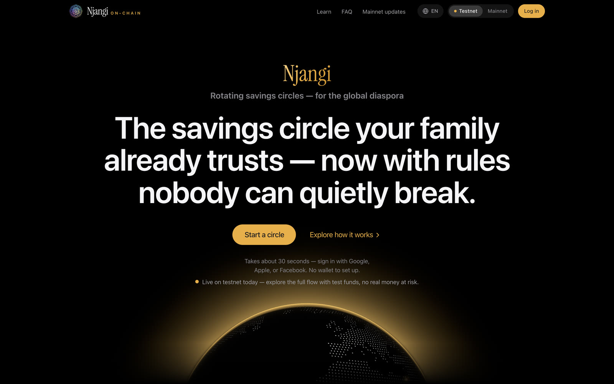
</p>

<h1 align="center">Njangi On-Chain</h1>

<p align="center">
  <b>The savings circle your family already trusts — now with rules nobody can quietly break.</b><br>
  Non-custodial coordination software for rotating savings circles (njangi, tontine, susu, chama, stokvel …), built on Sui.
</p>

<p align="center">
  <a href="https://njangionchain.com"><b>Open the app</b></a> ·
  <a href="https://njangionchain.com/learn">Learn</a> ·
  <a href="https://njangionchain.com/pricing">Pricing</a> ·
  <a href="#run-it-locally">Run it locally</a> ·
  <a href="#documentation">Docs</a>
</p>

<p align="center">
  
  
  
  
</p>

---

## In 30 seconds

- **What it is.** A rotating savings circle: everyone pays the same amount each round, one member takes the whole pot, and it goes round until everyone has had a turn. Economists call it a ROSCA; families call it a njangi, a tontine, a susu, a chama, a stokvel.
- **What changes on-chain.** Nobody holds the pot — not a treasurer, not us. Each round's contributions sit in an escrow on Sui, and the member whose turn it is collects it into their own wallet. The schedule, the order and every payment are on a record the whole circle can check.
- **How you join.** Sign in with Google, Apple or Facebook. Your wallet is created in the background — no seed phrase, no app to install.
- **Who it's for.** Circles that already run on trust and a WhatsApp group, especially ones spread across countries.
- **Where it stands.** Live on **Sui testnet** at [njangionchain.com](https://njangionchain.com), with test funds only. Mainnet launch is pending.

## A quick tour

<p align="center">
  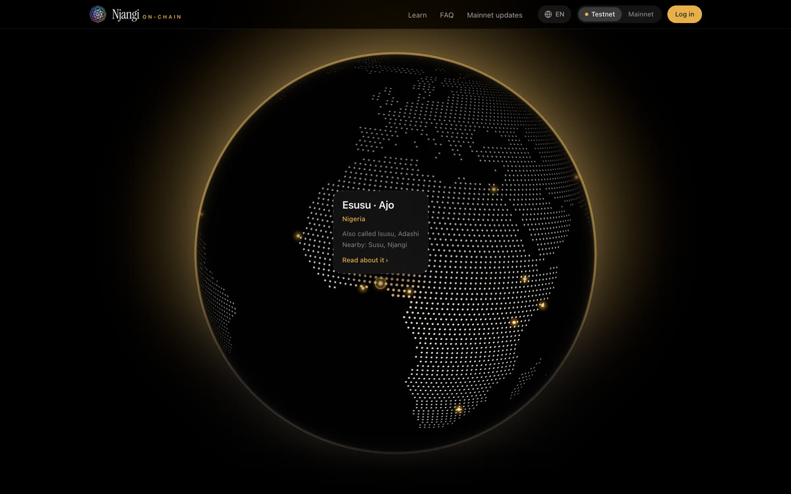
</p>
<p align="center"><sub>The globe names the savings circle wherever you hover — 20 traditions, each taken from the <a href="https://njangionchain.com/learn">/learn</a> glossary. Click one to read about it.</sub></p>

### How a circle works

<table>
  <tr>
    <td align="center" width="33%">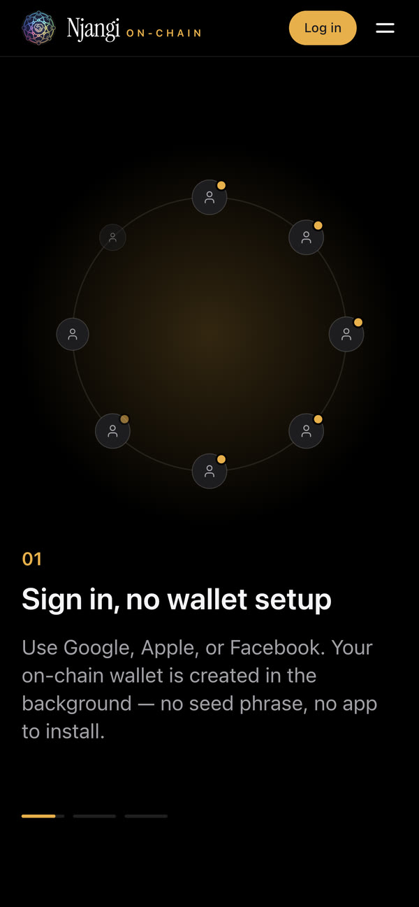</td>
    <td align="center" width="33%">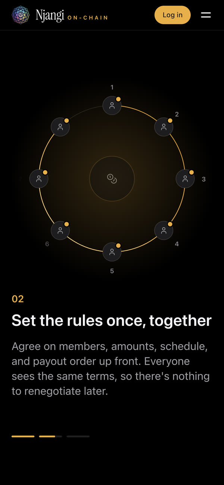</td>
    <td align="center" width="33%">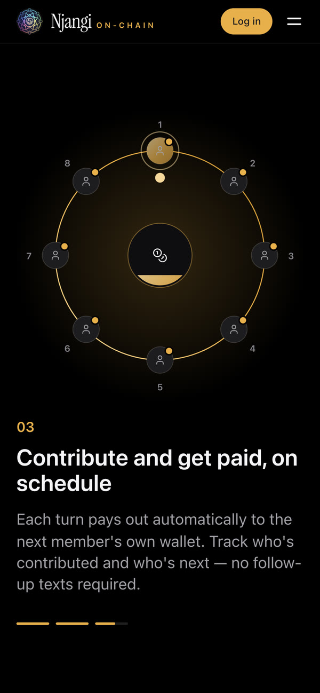</td>
  </tr>
  <tr>
    <td align="center"><b>1 · Sign in</b><br><sub>Google, Apple or Facebook. No seed phrase.</sub></td>
    <td align="center"><b>2 · Set the rules once</b><br><sub>Members, amount, schedule and payout order — visible to all.</sub></td>
    <td align="center"><b>3 · Contribute and collect</b><br><sub>Everyone pays in; the member whose turn it is collects.</sub></td>
  </tr>
</table>

1. **Create a circle** in one screen: the amount, the schedule, how many members, and the payout order. The security deposit is worked out for you.
2. **Invite people** with a link. It previews as a proper card in WhatsApp and iMessage, and the admin approves each request to join.
3. **Each round**, the admin opens a fresh escrow that freezes that round's members, amount and recipient. Members contribute from their own wallets.
4. **When everyone has paid**, the member whose turn it is collects the pot into their own wallet, and the rotation moves on in the same transaction.
5. **At the end of a lap**, the admin starts the next one. Security deposits come back through member-initiated flows, never by operator action.

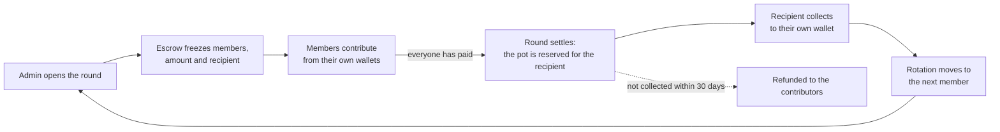

### What members see

<p align="center">
  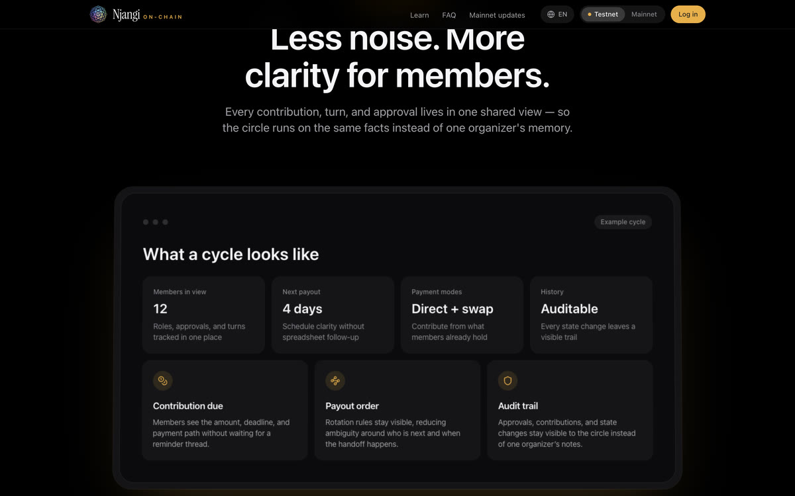
</p>

### Learn, pricing and writing

<table>
  <tr>
    <td width="50%">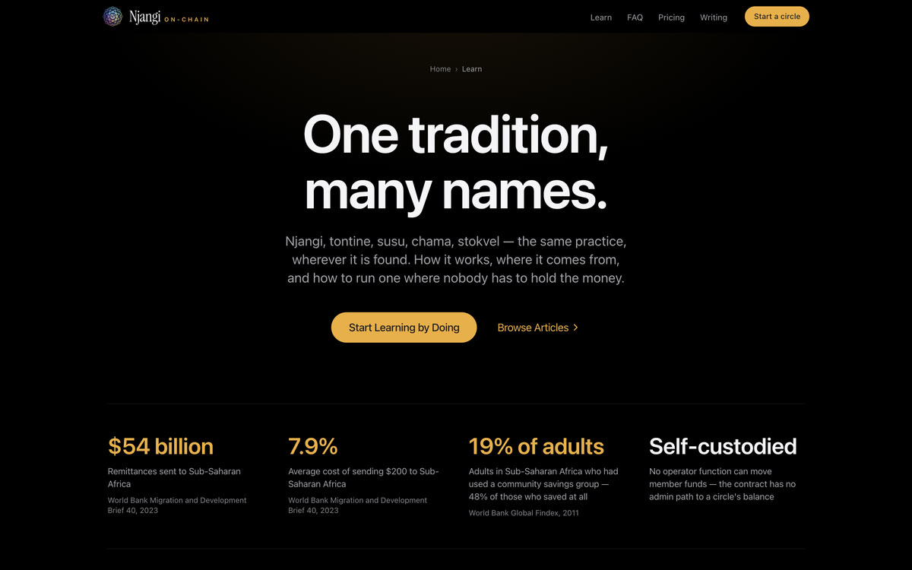</td>
    <td width="50%">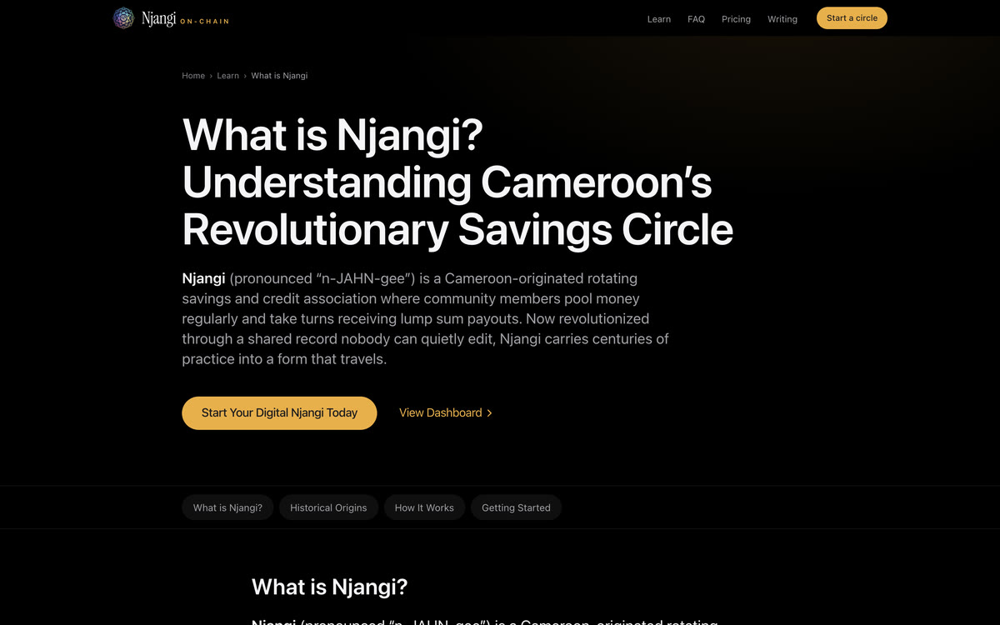</td>
  </tr>
  <tr>
    <td align="center"><sub><a href="https://njangionchain.com/learn">/learn</a> — guides and a glossary of rotating-savings traditions</sub></td>
    <td align="center"><sub><a href="https://njangionchain.com/learn/what-is-njangi">What is Njangi?</a> — one of the long-form guides</sub></td>
  </tr>
  <tr>
    <td width="50%">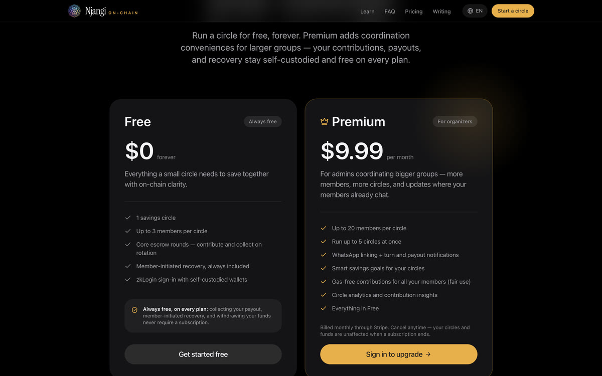</td>
    <td width="50%">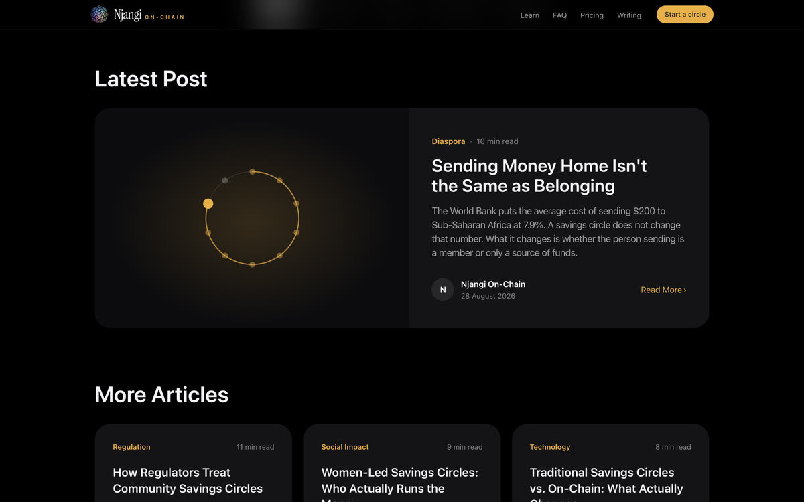</td>
  </tr>
  <tr>
    <td align="center"><sub><a href="https://njangionchain.com/pricing">/pricing</a> — free forever for a small circle</sub></td>
    <td align="center"><sub><a href="https://njangionchain.com/blog">/blog</a> — writing on community savings</sub></td>
  </tr>
</table>

## Why no one holds the pot

Njangi On-Chain is **coordination software**. It never holds members' money, and nothing in it lets an operator move a circle's funds.

| Guarantee | How it's enforced |
| --- | --- |
| **No one holds the pot** | Each round's money sits in its own escrow object on Sui. No admin or operator function can move it. |
| **Only the right person can collect** | The recipient is frozen when the round opens. Anyone may pay the gas to settle a funded round, but the payout can only ever go to that recipient, who collects it into their own wallet. |
| **Uncollected money goes back** | A payout that isn't collected within 30 days is refunded to the contributors. Stuck or abandoned circles are recovered by members, not by us. |
| **Your keys stay with you** | zkLogin: the signing key is created in your browser and never sent anywhere. The server only helps produce the zero-knowledge proof. `src/__tests__/no-key-transmission.test.ts` fails the build if client code ever sends it. |
| **Contact details stay private** | WhatsApp numbers are AES-256-GCM encrypted and stored on Walrus. Only an opaque pointer goes on-chain, never the number. |
| **Sanctions screening is on** | Joining a circle is screened against the OFAC list, and it fails closed if the list can't be checked ([`docs/sanctions-program.md`](docs/sanctions-program.md)). |

Five rules hold the whole design together. A change that breaks one is treated as a regulatory event, not a feature (see [`CLAUDE.md`](CLAUDE.md)):

1. **No custody** — no operator or admin function directs member funds.
2. **No fiat** — funding is an exchange transfer or a partner-hosted on-ramp, never us.
3. **No fees on money** — revenue is the coordination subscription, never a cut of contributions, payouts or swaps.
4. **No yield products** — a circle pays back what members put in, nothing more.
5. **Neutral swaps** — swaps are member-initiated, with no routing fee.

## Features

| Feature | What it does |
| --- | --- |
| **Social sign-in** | zkLogin through Enoki — Google, Apple or Facebook, with no wallet extension. |
| **One-screen setup** | Amount, schedule, members and order on one screen, with the deposit worked out for you. |
| **Invite links** | Share cards render server-side, so WhatsApp and iMessage show the circle, not a generic page. |
| **Per-round escrow** | Open, contribute, settle, collect, refund and advance, all on-chain. |
| **Assets** | SUI and USDC. Members can swap into the circle's currency themselves through Cetus. |
| **WhatsApp nudges** | "It's your turn" and payout notifications where the group already talks (Premium). |
| **Smart goals** | Savings goals and milestones on top of the rotation (Premium). |
| **Records** | A Founding Circle badge, a payout celebration, and member stories shared only with consent. |
| **The globe** | Hover or tap to see the local name of the savings circle in 20 places. |
| **Seven languages** | English and French in full; Nigerian Pidgin, Swahili, Amharic, Arabic and Farsi in part, with right-to-left support. |

## Plans

| | **Free** | **Premium** |
| --- | --- | --- |
| Price | $0, forever | $9.99 / month, billed through Stripe |
| Circles | 1 | Up to 5 at once |
| Members per circle | Up to 3 | Up to 20 |
| Escrow rounds, collecting, member recovery | ✓ | ✓ |
| WhatsApp turn and payout notifications | — | ✓ |
| Smart savings goals | — | ✓ |
| Circle analytics | — | ✓ |

Contributing, collecting your payout, recovery and withdrawals **never** require a subscription, on any plan.

## Architecture

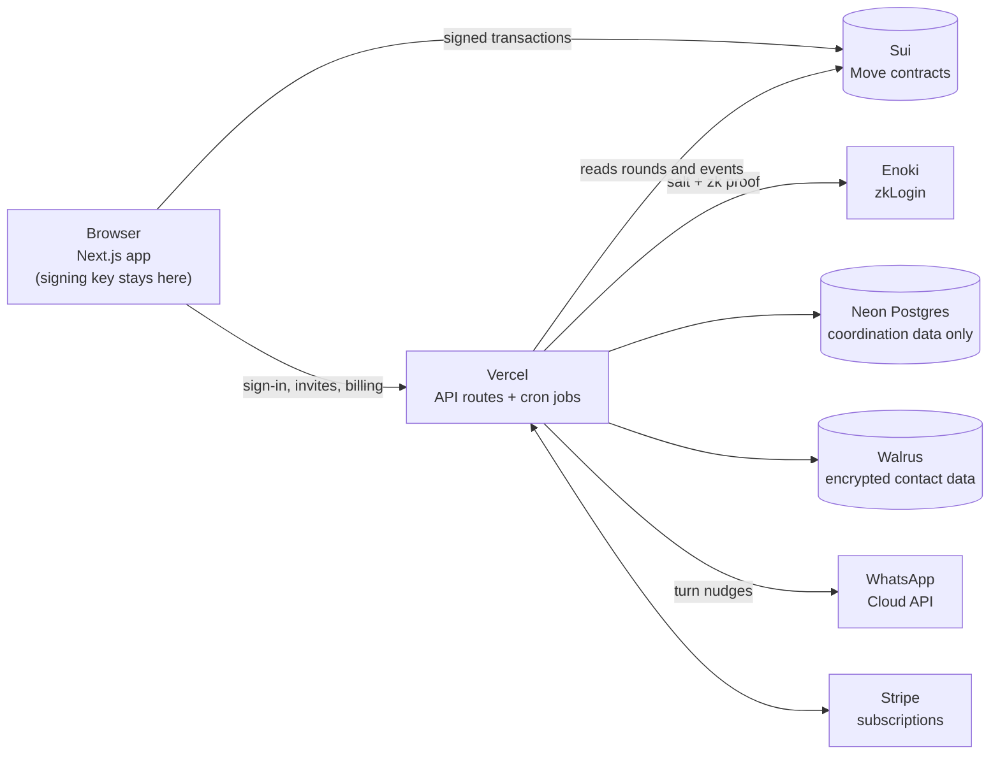

**Sui is the source of truth for money.** Circles, rounds, contributions and payouts live on-chain. Postgres holds only coordination data: join requests, preferences, the encrypted-contact index, compliance references and subscription status.

| Contract (`move/sources/`) | Role |
| --- | --- |
| `njangi_circles.move` | Circle lifecycle, members and the rotation |
| `njangi_cycle_escrow.move` | Per-round escrow: open, contribute, settle, collect, refund, advance |
| `njangi_custody.move` | Wallets for security deposits; only package code can move funds |
| `njangi_payments.move` | Permissionless payout trigger and recipient-pull claims |
| `njangi_members.move`, `njangi_circle_config.move` | Membership records and circle configuration |
| `njangi_milestones.move`, `njangi_goal_pool.move` | Savings goals and goal pools |
| `njangi_price_validator.move` | Exact-type registry of accepted assets |
| `njangi_compliance.move` | Opaque on-chain attestations and revocation |
| `njangi_core.move` | Time, decimal scaling and conversion helpers |
| `whatsapp_integration.move` | On-chain pointers to encrypted contact data on Walrus |

<details>
<summary><b>Repository layout</b></summary>

```text
move/               Move contracts, tests and publish scripts
src/pages/          Next.js pages (landing, app, /learn, /blog) and API routes
src/components/     UI — landing/, marketing/ and the app
src/lib/            Domain logic: chain reads, zkLogin, Walrus encryption, sanctions, billing gates
src/services/       Integrations: circles, zkLogin, RPC failover, on-ramps
src/content/        The glossary behind /learn
scripts/            Migrations, secrets, bootstrap and generators
docs/               Runbooks, compliance and deployment guides
```

</details>

## Run it locally

You'll need **Node 24** and npm 10+, a **Postgres** database (local or [Neon](https://neon.tech)), and the [Sui CLI](https://docs.sui.io/references/cli) if you're working on the contracts.

```bash
git clone https://github.com/satemafac/njangi-on-chain.git
cd njangi-on-chain
npm install

cp .env.example .env.local     # then fill it in — see docs/environment.md
npm run generate:secrets       # fills in the random server secrets
npm run migrate:postgres       # creates the tables (idempotent)
npm run bootstrap:sanctions    # loads the sanctions list; screening fails closed without it

npm run dev                    # http://localhost:3000
```

The public pages work out of the box. Signing in needs OAuth client IDs (`NEXT_PUBLIC_GOOGLE_CLIENT_ID` …) and an Enoki API key in `.env.local`.

**Checks**

```bash
npm test              # Jest: unit and integration tests
npm run check:copy    # user-facing copy guard (no returns/yield vocabulary)
npm run preflight     # network manifest, Move build, types, lint, copy guard and SEO tests
```

**Contracts**

```bash
cd move
sui move build
sui move test
```

<details>
<summary><b>Deploying</b></summary>

The web app runs on **Vercel** with **Neon** Postgres. Merging to `main` deploys production.

1. Provision Postgres, set `DATABASE_URL`, then run `npm run migrate:postgres` and `npm run bootstrap:sanctions`.
2. Set the variables from `.env.example` in Vercel. Server secrets must **not** use the `NEXT_PUBLIC_` prefix, which would ship them to the browser.
3. Cron jobs are declared in [`vercel.json`](vercel.json): turn nudges, circle-event relays and the daily Walrus renewal. Each authenticates with `CRON_SECRET`.

Publishing or upgrading contracts is a separate runbook — see [`CLAUDE.md`](CLAUDE.md) and [`docs/deployment-guide.md`](docs/deployment-guide.md).

</details>

## On-chain (testnet)

| | Address |
| --- | --- |
| Package, latest (v9) — use for calls | `0xf8afd3dfcf94f152ec9d1f8cb870b77525353a20564bb0224bcad5520d621614` |
| Package, original — object and event types | `0x89cddf4dfe654e7c7b16333096d9e750cf04bb96f7de934403a512d460594f02` |
| UpgradeCap — the source of truth for what's live | `0xc590f7b3ad86a637d2a85100703417b1a918dd02d64ebdc2c8413d0d179a7cb4` |

Mainnet is not launched yet. [`move/Published.toml`](move/Published.toml) records each publish.

## Documentation

- [Environment variables](docs/environment.md) · [Deployment guide](docs/deployment-guide.md)
- [Move contracts](move/README.md) · [Secure storage with Enoki and Walrus](docs/secure-storage-with-enoki.md)
- [WhatsApp integration](docs/whatsapp-integration-setup.md) · [Sanctions program](docs/sanctions-program.md)
- [Compliance roadmap](docs/compliance-roadmap-cex-dex-non-kyc.md) · [End-to-end browser runbook](docs/e2e-browser-runbook.md)
- [`CLAUDE.md`](CLAUDE.md) — the full engineering handbook: invariants, runbooks and hard-won lessons

## Support

Questions or problems? Use the support address in the app's footer, or [open an issue](https://github.com/satemafac/njangi-on-chain/issues).

<sub>Njangi On-Chain is coordination software for savings circles. It never holds your money, never offers an investment, and never pays a return. The app currently runs on Sui testnet with test funds only.</sub>
