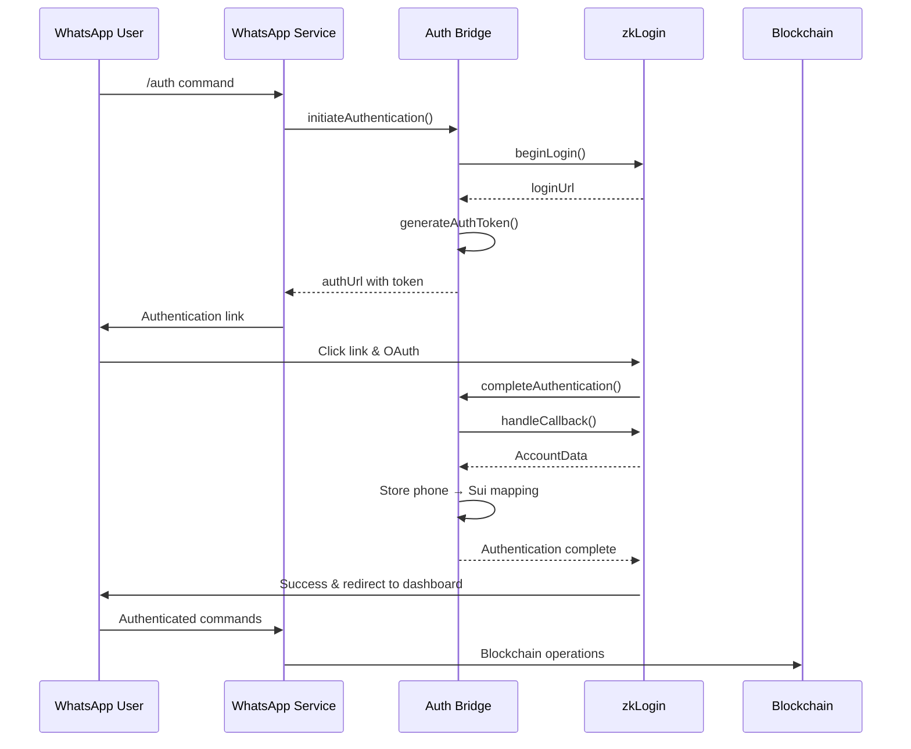

# WhatsApp Authentication Bridge Documentation

This document describes the secure authentication bridge that links WhatsApp phone numbers to Sui blockchain addresses using zkLogin.

## Overview

The WhatsApp Authentication Bridge provides a secure, seamless way for WhatsApp users to authenticate with the Njangi blockchain platform without leaving the WhatsApp interface. Users can authenticate once and then perform all circle management operations through WhatsApp commands.

## Architecture

### Core Components

1. **WhatsAppAuthBridgeService** - Core service managing authentication flows
2. **Web Authentication Interface** - User-facing authentication page
3. **API Endpoints** - RESTful APIs for authentication operations
4. **WhatsApp Service Integration** - Command handling with auth awareness

### Authentication Flow



## Components Reference

### WhatsAppAuthBridgeService

**Location**: `src/services/whatsapp-auth-bridge.service.ts`

**Key Methods**:
- `initiateAuthentication(phone, provider)` - Start auth flow
- `completeAuthentication(token, phone, jwt)` - Complete OAuth callback
- `isPhoneNumberAuthenticated(phone)` - Check auth status
- `getSuiAddressForPhone(phone)` - Get mapped Sui address
- `getAccountDataForPhone(phone)` - Get full account data

**Features**:
- Secure token generation with 30-minute expiry
- Phone number to Sui address mapping
- Session state management
- Automatic cleanup of expired tokens
- Backup/restore functionality

### Web Authentication Interface

**Location**: `src/pages/auth/whatsapp.tsx`

**Features**:
- Beautiful, responsive UI with status indicators
- Real-time authentication progress feedback
- Error handling with retry functionality
- Integration with existing `LoginButton` component
- Automatic redirect to dashboard on success

**URL Format**: `/auth/whatsapp?token=<auth_token>&phone=<phone_number>`

### API Endpoints

#### 1. Initiate Authentication
- **Endpoint**: `GET /api/whatsapp/auth/initiate`
- **Parameters**: `phone` (required), `provider` (optional, default: Google)
- **Response**: Redirects to authentication URL or returns success if already authenticated

#### 2. Complete Authentication
- **Endpoint**: `POST /api/whatsapp/auth/complete`
- **Body**: `{ token, phone, jwt }`
- **Response**: Authentication result with Sui address and account data

#### 3. Check Status
- **Endpoint**: `GET /api/whatsapp/auth/status`
- **Parameters**: `phone` (required)
- **Response**: Authentication status, Sui address, last authenticated date

### WhatsApp Service Integration

**Location**: `src/services/whatsapp.service.ts`

**New Methods**:
- `handleAuthenticationCommand(phone, provider)` - Handle `/auth` command
- `isUserAuthenticated(phone)` - Check if user is authenticated
- `getUserSuiAddress(phone)` - Get user's Sui address
- `getUserAccountData(phone)` - Get full account data
- `sendAuthenticationRequired(phone)` - Send auth required message

**Enhanced Features**:
- Authentication-aware welcome messages
- Command handling based on auth status
- Automatic authentication prompts for restricted commands

## Security Features

### Token Security
- **Secure Generation**: Cryptographically secure random tokens (32-byte hex)
- **Time-Limited**: 30-minute expiry for auth tokens
- **Single-Use**: Tokens can only be used once
- **Phone Binding**: Tokens are bound to specific phone numbers

### Phone Number Validation
- **Format Validation**: International format required (+1234567890)
- **Regex Pattern**: `/^\+[1-9]\d{1,14}$/`
- **Sanitization**: Consistent formatting and storage

### Session Management
- **State Tracking**: Authentication status, last activity, verification status
- **Automatic Cleanup**: Expired tokens and sessions are automatically removed
- **Audit Logging**: All authentication events are logged

### Data Protection
- **Encrypted Storage**: Sensitive data stored securely
- **Minimal Exposure**: Only necessary data exposed in API responses
- **Access Control**: Authentication required for sensitive operations

## Usage Examples

### User Authentication Flow

1. **User sends command**:
   ```
   User: /auth
   ```

2. **Bot responds with auth link**:
   ```
   Bot: 🔐 Please complete your authentication:
   
   👉 https://yourdomain.com/auth/whatsapp?token=abc123...&phone=%2B1234567890
   
   This link will expire in 30 minutes.
   ```

3. **User clicks link and authenticates**:
   - Redirected to authentication page
   - Chooses Google/Facebook/Apple
   - Completes OAuth flow
   - Account linked to phone number

4. **User can now use authenticated commands**:
   ```
   User: /create
   Bot: ✅ Let's create your savings circle! What would you like to name it?
   ```

### Developer Integration

```typescript
import { WhatsAppAuthBridgeService } from '../services/whatsapp-auth-bridge.service';

const authBridge = WhatsAppAuthBridgeService.getInstance();

// Check if user is authenticated
if (authBridge.isPhoneNumberAuthenticated(phoneNumber)) {
  const suiAddress = authBridge.getSuiAddressForPhone(phoneNumber);
  const accountData = authBridge.getAccountDataForPhone(phoneNumber);
  
  // Proceed with authenticated operations
  await performBlockchainOperation(accountData);
} else {
  // Prompt for authentication
  await sendAuthenticationRequired(phoneNumber);
}
```

## Configuration

### Environment Variables

```env
# WhatsApp Business API (required)
WHATSAPP_PHONE_NUMBER_ID=your_phone_number_id
WHATSAPP_ACCESS_TOKEN=your_access_token
WHATSAPP_VERIFY_TOKEN=your_verify_token
WHATSAPP_APP_SECRET=your_app_secret

# Application URLs
NEXT_PUBLIC_BASE_URL=https://yourdomain.com
```

### Session Configuration

```typescript
// From src/config/whatsapp.config.ts
export const sessionConfig = {
  sessionTimeout: 60 * 60 * 1000,    // 1 hour
  flowTimeout: 30 * 60 * 1000,       // 30 minutes
  maxRetries: 3,
  retryDelay: 2000,
};
```

## Error Handling

### Common Error Scenarios

1. **Invalid Token**:
   ```json
   {
     "success": false,
     "error": "Invalid or expired authentication token"
   }
   ```

2. **Phone Number Mismatch**:
   ```json
   {
     "success": false,
     "error": "Phone number mismatch"
   }
   ```

3. **Authentication Expired**:
   ```json
   {
     "success": false,
     "error": "Authentication token expired"
   }
   ```

### Error Recovery

- **Automatic Retry**: Failed operations can be retried
- **Token Regeneration**: New tokens can be generated for expired ones
- **Fallback Authentication**: Web interface provides alternative auth path
- **Clear Error Messages**: User-friendly error descriptions

## Monitoring & Analytics

### Service Statistics

```typescript
const stats = authBridge.getStats();
// Returns:
// {
//   activeTokens: 15,
//   authenticatedPhones: 247,
//   verifiedMappings: 240
// }
```

### Audit Logging

All authentication events are logged with:
- Timestamp
- Phone number
- Action performed
- Success/failure status
- Error details (if applicable)

### Health Monitoring

- Authentication success rates
- Token expiry rates
- Session duration metrics
- Error frequency analysis

## Testing

### Unit Tests

```typescript
describe('WhatsAppAuthBridgeService', () => {
  it('should generate valid auth tokens', () => {
    const result = authBridge.initiateAuthentication('+1234567890');
    expect(result.success).toBe(true);
    expect(result.authUrl).toMatch(/^https:\/\//);
  });

  it('should verify phone number mapping', () => {
    authBridge.completeAuthentication(token, phone, jwt);
    expect(authBridge.isPhoneNumberAuthenticated(phone)).toBe(true);
  });
});
```

### Integration Tests

```typescript
describe('Authentication Flow', () => {
  it('should complete full auth flow', async () => {
    // 1. Initiate authentication
    const initResult = await authBridge.initiateAuthentication('+1234567890');
    
    // 2. Mock OAuth callback
    const jwt = 'mock_jwt_token';
    
    // 3. Complete authentication
    const completeResult = await authBridge.completeAuthentication(
      initResult.token, '+1234567890', jwt
    );
    
    expect(completeResult.success).toBe(true);
    expect(completeResult.suiAddress).toBeDefined();
  });
});
```

## Troubleshooting

### Common Issues

1. **Authentication fails**:
   - Check zkLogin service status
   - Verify OAuth provider configuration
   - Confirm API keys are valid

2. **Tokens expire quickly**:
   - Check system clock synchronization
   - Verify session timeout configuration
   - Monitor token cleanup intervals

3. **Phone number not recognized**:
   - Verify international format (+1234567890)
   - Check for special characters or spaces
   - Confirm regex validation pattern

### Debug Mode

Enable debug logging:
```typescript
// Set log level to debug
logger.level = 'debug';

// Check authentication status
console.log(authBridge.getAuthenticationStatus(phoneNumber));

// View active tokens
console.log(authBridge.getStats());
```

## Future Enhancements

### Planned Features

1. **Multi-Provider Support**: Support for additional OAuth providers
2. **Biometric Authentication**: Optional biometric verification
3. **Session Persistence**: Cross-device session synchronization
4. **Advanced Security**: Additional security layers for high-value operations

### Performance Optimizations

1. **Caching**: Redis-based session caching
2. **Database Integration**: Persistent storage for phone mappings
3. **Rate Limiting**: Enhanced rate limiting per phone number
4. **Monitoring**: Advanced metrics and alerting

---

*Last updated: 2025-06-23*

*For implementation details, see the source code in `src/services/whatsapp-auth-bridge.service.ts`* 